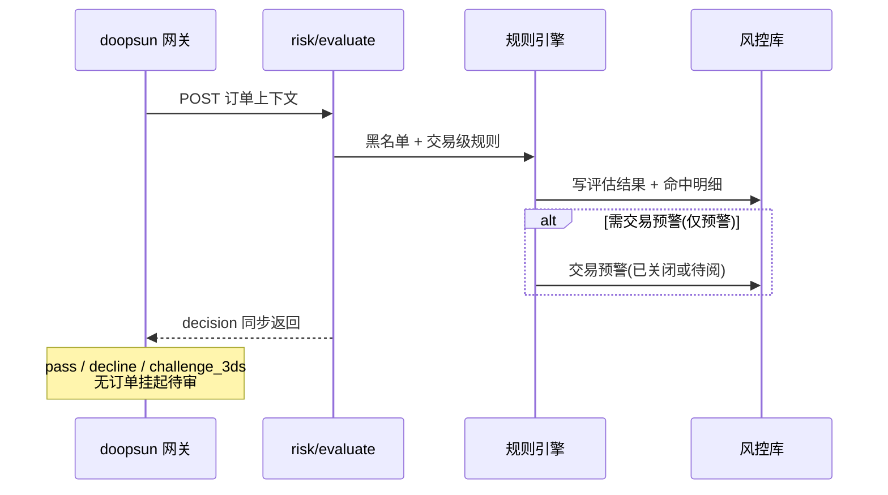

# 02 — 核心业务流程

## 0. 交易级 vs 商户级（必读）

| 维度 | 交易级（单笔订单） | 商户级 |
|------|-------------------|--------|
| 评估入口 | `POST /api/v1/risk/evaluate` | 定时/实时聚合任务、商户监控规则 |
| 人工审核 | **无** — 订单不挂起、不待审 | **有** — 入网、交易量异常、存续风险等 |
| 典型结果 | 通过 / 拒绝 / 3DS / 仅预警 | 暂停收单、暂停结算、观察、商户工单 |
| 预警对象 | 交易预警（记录命中，可选关联订单号） | 商户预警（无订单号或仅引用触发单） |

> **约定**：原型中的订单「人工审核」「审核中」仅为演示，**正式开发不实现**。原绑定「人工审核」的订单规则，改配为「拒绝交易」「3DS 强验」或「仅预警」。

---

## 1. 交易风控主链路（P0）



### 1.1 评估逻辑

1. 遍历**交易级**已启用规则，执行 `check(order)`，收集命中列表
2. **综合风险等级** = 命中规则中最高等级
3. **最终处置策略** = 命中策略中优先级最高（数字最小）的一条，且 **scope = 交易级**
4. 按策略给出 **同步决策**（网关当场执行），必要时写交易预警（不挂起订单）
5. 评估完成后尝试 STR 自动推送（若配置启用）

**商户级规则**（如 R026 放量异常）在 evaluate 时若命中：对该笔订单通常返回 **decline**（商户已暂停）或 **decline + 触发商户工单**（见 §2），不在订单上进入人工审核态。

### 1.2 处置策略 → 订单终态（交易级）

| 策略 | evaluate decision | 订单展示状态 | 说明 |
|------|-------------------|--------------|------|
| 拒绝交易 / 商户已暂停 | `decline` | 拦截 | 同步拒绝 |
| 3DS强验 | `challenge_3ds` | 成功 或 失败 | 由网关完成 3DS 后定终态，**不进入待审** |
| 仅预警 | `pass` | 成功 | 写预警记录，不阻断 |
| 延迟结算 / 限制额度 / 加入观察 / 调单 | `pass` 或 `decline` | 按策略配置 | 不挂起；调单为事后 Retrieval，非授权挂起 |
| 无命中 | `pass` | 成功 | 低风险 |

**不存在**：订单状态「审核中（待人工）」、decision `manual_review`。

### 1.3 evaluate 响应 decision 枚举

| decision | 含义 | doopsun 网关行为 |
|----------|------|------------------|
| `pass` | 通过 | 正常授权 |
| `decline` | 拒绝 | 拒绝授权 |
| `challenge_3ds` | 强验 | 发起 3DS Challenge，成败由网关闭环 |

---

## 2. 商户交易量异常 + 商户人工审核（P0/P1）

### 2.1 触发条件（建议）

对**已入网商户**按日/小时滚动统计，与近 30 日均值（或中位数）比较：

| 类型 | 示例阈值 | 说明 |
|------|----------|------|
| **暴涨** | 当日笔数或金额 ≥ 近 30 日均值 × **500%** | 对应规则 R026；账户被盗、异常放量 |
| **暴跌** | 当日笔数或金额 ≤ 近 30 日均值 × **20%** | 需业务确认阈值；异常关停、跑路前信号 |

可配置：仅笔数、仅金额、或二者满足其一。

### 2.2 自动处置（命中即执行，无需等人工）

```
检测到暴涨/暴跌
       │
       ├──► doopsun：暂停交易（拒绝新单 / suspend_merchant）
       │
       ├──► doopsun：暂停结算（冻结打款、资金暂挂）
       │
       └──► 风控库：创建商户预警/工单（待人工审核）
```

| 动作 | 执行方 | 说明 |
|------|--------|------|
| 暂停交易 | doopsun + 风控回调 | 商户 `收单状态` → 暂停；新单 evaluate 直接 decline |
| 暂停结算 | doopsun 结算模块 | 在途资金不结算，直至商户人工审核通过 |
| 商户人工审核 | 风控后台 | 合规/风控专员核查原因后解除或维持 |

### 2.3 商户人工审核状态机

```
              自动命中暴涨/暴跌
                     │
                     ▼
              ┌─────────────┐
              │   待处理     │
              └──────┬──────┘
                     │ 专员接单
                     ▼
              ┌─────────────┐
              │   处理中     │
              └──────┬──────┘
         ┌───────────┼───────────┐
         ▼           ▼           ▼
   ┌──────────┐ ┌──────────┐ ┌──────────┐
   │ 审核通过  │ │ 维持暂停  │ │ 误报关闭  │
   │ 恢复交易  │ │          │ │          │
   │ 恢复结算  │ │          │ │          │
   └──────────┘ └──────────┘ └──────────┘
```

**审核通过**：回调 doopsun 恢复收单、恢复结算，商户状态 → 正常/观察。

**维持暂停**：保持暂停交易与暂停结算，可升级 EDD/STR。

**误报关闭**：恢复交易与结算，记录原因。

### 2.4 与单笔订单的关系

- 异常判定基于**商户维度聚合**，不针对某一单挂起
- 触发时已产生的在途单：按「暂停结算」策略处理；**新单**一律拒绝
- 订单监控中仍可看到历史单及命中规则；**不出现**「待人工审核」订单状态

---

## 3. 交易预警流程（P0）

交易级预警用于 **仅预警、调单跟进、高风险记录** 等，**不是**订单人工审核队列。

### 3.1 状态机

```
命中且 push_alert=true
       │
       ▼
  待处理 ──► 处理中 ──► 已关闭
              │
              └── 调单：上传材料、跟进商户
```

| 状态 | 含义 |
|------|------|
| 待处理 | 待专员查看（非订单挂起） |
| 处理中 | 调单/跟进中 |
| 已关闭 | 误报、已跟进完毕 |

### 3.2 处理模式（无「订单人工审核」）

#### A. 默认 / 仅预警

- 订单已是终态（成功或拦截）
- 人工：确认记录、误报关闭

#### B. 调单（CHARGEBACK_INQUIRY）

- 事后向商户索要凭证，**不改变**该笔授权时的 pass/decline
- 上传调单材料、填写说明、关闭预警

---

## 4. 商户入网人工审核（P1）

```
外部 CRM 同步资料 → 入网评估 → 商户人工审核 → 批准/条件通过/拒绝
```

此为**商户级**人工审核，与交易 evaluate 无关。

| 结论 | 审核状态 | 收单状态 |
|------|----------|----------|
| 批准入驻 | 批准入驻 | 正常 |
| 条件通过 | 条件通过 | 观察 |
| 拒绝入驻 | 拒绝入驻 | 未开通 |

---

## 5. 商户复评流程（P1）

- 定时或手动重算综合评分与风险等级
- 拒付率/欺诈率/放量等维度超标 → 可联动 **商户级** 限制或暂停（非订单挂起）

---

## 6. STR / EDD（P2）

逻辑不变；STR/EDD 为合规工单，与「订单挂起待审」无关。交易量异常商户人工审核可与 EDD/STR 联动升级。

---

## 7. 规则配置变更

- 交易级规则保存后，仅影响后续 evaluate
- 商户监控规则（含放量暴涨/暴跌）保存后，由**定时任务或实时聚合**检测，命中则走 §2

---

## 8. 审计日志

须记录：商户暂停/恢复交易、暂停/恢复结算、商户人工审核结论、交易 evaluate 拦截原因。

---

## 9. 非功能需求

| 项 | 建议 |
|----|------|
| evaluate 超时 | 网关侧超时策略（pass 或 decline，业务定） |
| 幂等 | 同一 `order_no` 同阶段重复 evaluate 结果一致 |
| 商户放量检测 | 建议独立 job（如每 15min / 每小时），与单笔 evaluate 解耦 |
| 暴跌阈值 | 与业务确认后写入 `risk_rule.config` |
